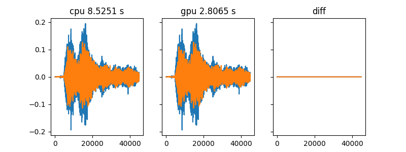

# Python toolbox
A collection of python scripts,

** this doc need update, but all scripts work well, I used them in my daily work **

## Dataset

Read audio dataset and return a sample generator, used for DNN model. 

eg. (directly copy from my code)

```python
self.dataset_train = Dataset(                                           
                        file_reader=self.file_reader,                   
                        file_paths=self._get_file_path(                 
                            self.train_set_dir),                        
                        shuffle_size=self.batch_size*5,                 
                        batch_size=self.batch_size,                     
                        output_shapes=[[self.frame_len, 2, 1],          
                                       [self.frame_len, 2, 1],          
                                       [self.n_azi]])                                 
                                                                        
self.logger.info('start training')                                      
for epoch in range(cur_epoch+1, self.max_epoch):                        
    optimizer = tf.optimizers.Adam(lr)                                  
    self.dataset_train.reset()                                          
    t_start = time.time()                                               
    while not self.dataset_train.is_finish():                           
        x_d, x_r, y_loc = self.dataset_train.next_batch()               
        y_irm = self.ideal_irm_nn(x_d, x_r)     
```

## easy_parallel

A wrapping of  `mutliprocess` module, run your code in parallel in a few lines.

```python
def test_func(*args):                                                       
    print(args)                                                             
    time.sleep(np.random.randint(10, size=1))                                                                      
    return args                                                             
                                                                            
# tasks = [[i] for i in range(32)]                                          
tasks = np.random.rand(32, 2)                                               
outputs = easy_parallel(test_func, tasks, show_process=True)                
print(outputs)        
```

## ProcessBar

  Process bar, additonally can show cpu and memory percentage

## Reverb

reverberation related

## wav_tools

  Functions related to signal process
  ```
wav_tools
|
|---brir_filter(x,brir)
|
|---cal_bw(self,cf)
|
|---cal_erb(self,cf)
|
|---cal_power(x)
|
|---cal_snr(tar,inter,frame_len=None,shift_len=None,is_plot=None)
|
|---erbscal2hz(self,erb_num)
|
|---frame_data(x,frame_len,shift_len)
|
|---gen_wn(shape,ref=None,energy_ratio=0,power=1)
|
|---hz2erbscal(self,freq)
|
|---plot_tools
|
|---resample(x,orig_fs,tar_fs)
|
|---set_snr(x,ref,snr)
|
|---truncate_data(x,type=both,eps=1e-05)
|
|---wav_read(fpath,tar_fs=None)
|
|---wav_write(x,fs,fpath)
  ```

## GPU_filter
  A tensorflow implementation of FIR filter, containing 2 functions, `filter`, `brir_filter`

  Comparison to `filter` in `scipy`(marked as 'cpu', cpu consumption was around 50%, GPU: TITAN RTX， CPU:i9-9980XE)

  

## send_email
send simple notification to your email box. Before using, create `.send_email.cfg` in your home directory
eg.
```
[sender]
add = 
pwd = 
stmp_add = 
stmp_port = 
[receiver]
add = 
```
