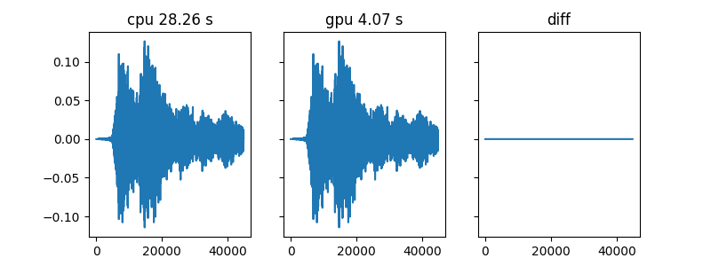
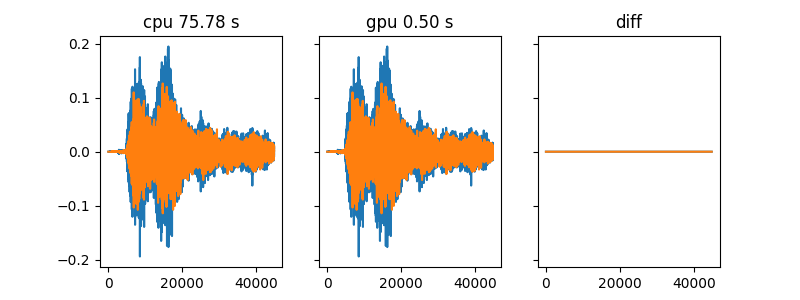

# Small python toolbox
A collection of python scripts,

file structure
```shell
basic_tools
├── ccf.py  #cross-correlation functions(ccf,gcc-phat)
├── __init__.py
├── process_bar.py
├── query_resrc.py  #get cpu and memory usage
├── reverb_time.py  #calculte RT60 from room impulse response(RIR)
├── TFData.py # data pipe for tensorflow
└── wav_tools.py  #functions related to signal process
```


## TFData

  Data pipe for tensorflow

  Example

  ```python
  with tf.Session() as sess:
    coord = tf.train.Coordinator()
    train_tfdata = TFData.TFData(train_set_dirs,[None,x_len],[None,y_len],
                                batch_size,N_batch_in_queue,coord,file_reader_func,is_repeat)
    train_x_batch,train_y_batch = train_tfdata.dequeue()
    for epoch in range(max_epoch):
        # open data-reading thread in each epoch
        threads = train_tfdata.start_thread(sess)
        # until at least one batch data has been ready
        while sess.run(train_tfdata.x_queue.size())<batch_size:
            time.sleep(0.5)
        #
        print('epoch %d'%epoch)
        # one epoch finished when:
        #   1. all files has be read;
        #   2. Number of samples is less than one batch
        while (not train_tfdata.is_epoch_finish) or
                  (sess.run(train_tfdata.x_queue.size())>=batch_size):
            train_batch_value = sess.run([train_x_batch,train_y_batch])
            sess.run(opt_step,feed_dict={x:train_batch_value[0],
                                         y:train_batch_value[1],
                                         learning_rate:lr})
        # clear queue
        train_tfdata.empty_queue(self._sess)
  ```

## process_bar

  Process bar, additonally can show cpu and memory percentage

  Example

  ```python
  from process_bar import process_bar
  p = process_bar(100,is_show_resrc) # show current cpu and memory usage
  for i in range(100):
    p.update()
  ```
  if `is_show_resrc=False` <pre>|============================                      | process 56%</pre>
  if `is_show_resrc=True`
   <pre>|=======================                           | process 47% 	 Cpu:1.60% Mem:26.78%</pre>

## query_resrc

  Get cpu and memory usage(%)

  Example

  ```shell
  python query_resource.py
  ```

  `cpu:1.70%  mem:30.09%`

## reverb-time

  Calculte RT60 from room impulse response(RIR)

## wav_tools

  Functions related to signal process
  ```
wav_tools
|
|---brir_filter(x,brir)
|
|---cal_bw(self,cf)
|
|---cal_erb(self,cf)
|
|---cal_power(x)
|
|---cal_snr(tar,inter,frame_len=None,shift_len=None,is_plot=None)
|
|---erbscal2hz(self,erb_num)
|
|---frame_data(x,frame_len,shift_len)
|
|---gen_wn(shape,ref=None,energy_ratio=0,power=1)
|
|---hz2erbscal(self,freq)
|
|---plot_tools
|
|---resample(x,orig_fs,tar_fs)
|
|---set_snr(x,ref,snr)
|
|---test()
|
|---truncate_data(x,type=both,eps=1e-05)
|
|---vad(x,frame_len,shift_len=None,theta=40,is_plot=False)
|
|---wav_read(fpath,tar_fs=None)
|
|---wav_write(x,fs,fpath)
```

## Filter_GPU
  A tensorflow implementation of FIR filter, contraining 2 functions, `filter`, `brir_filter`

  Comparation to filter implementation based on `scipy`(marked as 'cpu'), time consumings are given in title.

  
  
